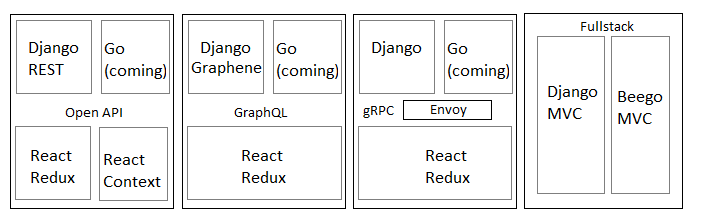

# Bookstore

In these days, most of applications are on the web.  
With various frameworks, how do you find a good pick?

## Bookstore

To do mock up or presentation, we want to the application ready in a short time to demonstrate to manager team. When the business plan initial, can you still back on the mock up continue to work or move to other higher performance framework?  
Or what if I want to switch framework after some works done.  
Do I have any options? Here, I have some answers.

In these days, most of applications are on the web.  
With various frameworks, how do you find a good pick?

In here, I am going to use bookstore model as example in some different kinds of projects.

In the simple data collection/presentation, we want to the application ready in a short time.  
In a mission critical transaction, we may consider the performance.

What if you want to have a quick prototype to present to manager team, then deep dive into the right solution after planned?  
In here, I am going to have solution of how to do.

## Bookstore Projects in Github

_At this moment, I got most of coding sample ready. Will still need to catch up all the writing._

* Fullstack MVC
  * [Django MVC](https://github.com/ccapeng/django-bookstore)
  * [Django REST Framework + React](https://github.com/ccapeng/bookstore_api)
  * [Protected React](https://github.com/ccapeng/bookstore_pro)  

      Django REST Framework + Protected React JS  

      Need to login to have both REST APIs and React JS to work.  

      [How this works?](./)

  * [Go & Beego](https://github.com/ccapeng/beego-bookstore)
* REST
  * Data model: coming
  * Backend
    * \[Django REST Framework Full Stack\]\(\([https://github.com/ccapeng/bookstore\_api](https://github.com/ccapeng/bookstore_api)\)\) from fullstatck.
      * [Django REST framework](topic-django-rest.md)
    * Go: coming
  * Frontend
    * [React Context](https://github.com/ccapeng/bookstore-context)
    * [React Redux](https://github.com/ccapeng/bookstore-redux)
    * [React Hook Redux](https://github.com/ccapeng/bookstore-hook-redux)
    * [React Hook Redux TypeScript](https://github.com/ccapeng/bookstore-tx-redux)
    * React Hook Redux TypeScript Advance : coming
* GraphQL
  * Backend [Django Graphene](https://github.com/ccapeng/bookstore_graphene).
  * Frontend
    * [React redux graphQL](https://github.com/ccapeng/bookstore-redux-graphql)
  * [How to handle cross origin?](topic-graphql-cross-origin.md)
* gRPC
  * Backend

      [Django gRPC](https://github.com/ccapeng/bookstore_grpc).  

      Go : coming

  * Frontend
    * [React redux grpc](https://github.com/ccapeng/bookstore-redux-grpc)
  * How to migrate from REST? \(coming\)
* Migration Options
  * [Use Open API data model](topic-use-open-api.md)
  * [Switch between Django and Go](topic-switch-between-django-and-go.md)
  * [React context and redux difference](topic-react-context-and-redux-diff.md)
  * [Migrate from REST to GraphQL](topic-rest-to-graphql.md)

### Bookstore Projects in Github

## Other Topics \(more experiences to share\)

* [Django Function Implementation](https://github.com/ccapeng/django-bookstore)
* [Django REST Framework](https://github.com/ccapeng/bookstore_api)
* [Go & Beego](https://github.com/ccapeng/beego-bookstore)
* [React Redux](https://github.com/ccapeng/bookstore-hook-redux) : frontend only. Use Django REST Framework as backend.
* [React Context](https://github.com/ccapeng/bookstore-context)
* React Redux in typescript. \(Coming soon\)
* How to use open API to quick implement backend. \(Coming soon\)
* React comprehensive tutorial. \(Coming soon\)
* [Best practice of programming](https://ccapeng.gitbook.io/programming/)
* [Graph](https://ccapeng.gitbook.io/graph/)
* [Namespace](https://ccapeng.gitbook.io/namespace/)
* [Context](https://ccapeng.gitbook.io/context/)

### Other Topics

## Contact Me

* [Best practice of programming](https://ccapeng.gitbook.io/programming/)
* [Graph](https://ccapeng.gitbook.io/graph/)
* [Namespace](https://ccapeng.gitbook.io/namespace/)
* [Context](https://ccapeng.gitbook.io/context/)

`ccapeng@gmail.com` \| [`ccapeng.github.io`](https://ccapeng.github.io)

