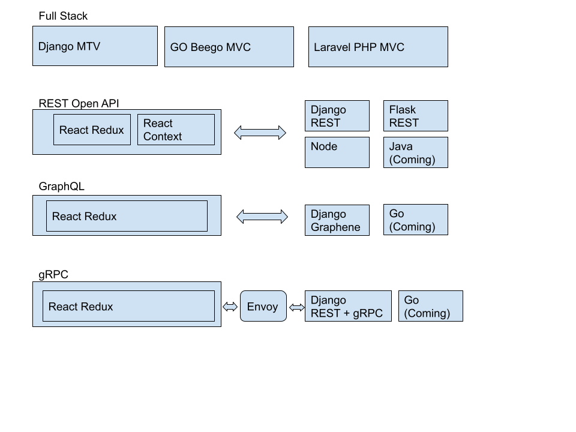

# Bookstore of REST, graphQL, gRPC

[View full document](https://ccapeng.gitbook.io/bookstores/)  

In these days, most of applications are on the web.  
With various frameworks, how do you pick for your need?  

## Framework selection and transition

In the simple data collection/presentation, 
we want to the application ready in a short time.  
In a mission critical transaction, we may consider the performance.  

What if you want to have a quick prototype to present to manager team, 
then deep dive into the right solution after planned?  
In here, I am going to have solution of how to do.  

In here, I am going to use bookstore model as example in some different kinds of projects.

## Bookstore Projects in Github

* Fullstack MVC
  * [Django MVC](https://github.com/ccapeng/django-bookstore)
    * [Form validation in view class](topic-django-class-view-validation.md)
		* Use PyPy to increase performance: coming
    
  * [Django REST Framework + React](https://github.com/ccapeng/bookstore_api)
    * [Serializer validation](topic-serializer-validation.md)
    
  * [Server Side React, login required](https://github.com/ccapeng/bookstore_pro)  

      Django REST Framework + Fully Server Side React JS (No Next.js)  

      Need to login to have both REST APIs and React JS to work.  
      No React JS expose to public.   
      [How this works?](topic-protect-react.md)

  * [Go & Beego](https://github.com/ccapeng/beego-bookstore)
  
  * [Laravel php](https://github.com/ccapeng/laravel_bookstore)
  
  * Electron (Coming)

* REST
  * [Data model](topic-django-rest.md)
  * Backend
    * [Django REST Framework Full Stack](https://github.com/ccapeng/bookstore_api) from fullstatck.
      * [Django REST framework](topic-django-rest.md)
    * Go: coming
    * Java: coming  

  * Frontend
    * [React Context](https://github.com/ccapeng/bookstore-context)
    * [React Redux](https://github.com/ccapeng/bookstore-redux)
    * [React Hook Redux](https://github.com/ccapeng/bookstore-hook-redux)
    * [React Hook Redux TypeScript](https://github.com/ccapeng/bookstore-tx-redux)
    * React Hook Redux TypeScript Advance : coming
    * PWA: comping
    * Lazy loading and Dynamic imports: coming
    * Server-rendered deno w/Aleph: coming
    * [React with simple state management Jotai](https://github.com/ccapeng/bookstore-jotai)
      * Migrate from Reduc to Jotai: Coming

* GraphQL
  * Backend [Django Graphene](https://github.com/ccapeng/bookstore_graphene).
  * Frontend
    * [React redux graphQL](https://github.com/ccapeng/bookstore-redux-graphql)
  * [Migrate from REST to GraphQL](topic-rest-to-graphql.md)  

* gRPC
  * Backend

      [Django gRPC](https://github.com/ccapeng/bookstore_grpc).  

      * Go : coming

  * Frontend
    * [React redux grpc](https://github.com/ccapeng/bookstore-redux-grpc)
  * How to migrate from REST? \(coming\)  
  
* Migration Options
  * [Use Open API data model](topic-use-open-api.md)
  * [Switch between Django and Go](topic-switch-between-django-and-go.md)
  * [React context and redux difference](topic-react-context-and-redux-diff.md)
  * [How to handle cross origin?](topic-cross-origin.md)

## Other Topics -- more experiences to share
* [Best practice of programming](https://ccapeng.gitbook.io/programming/)
* [Graph](https://ccapeng.gitbook.io/graph/)
* [Namespace](https://ccapeng.gitbook.io/namespace/)
* [Context](https://ccapeng.gitbook.io/context/)

## Contact Me
`ccapeng@gmail.com`  [`ccapeng.github.io`](https://ccapeng.github.io)  

[View full document](https://ccapeng.gitbook.io/bookstores/)  

