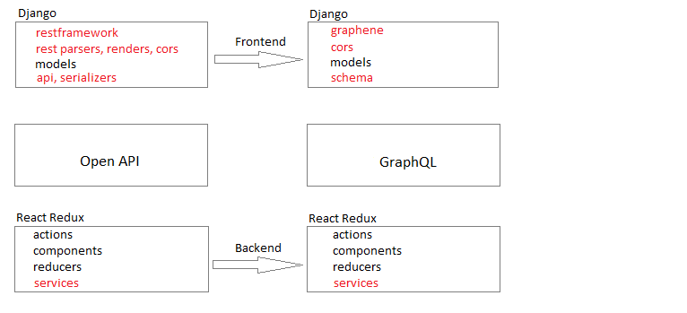

# Migrate REST to GraphQL



Only the red text parts are different.

- Repositories
	- REST : [https://github.com/ccapeng/bookstore_api](https://github.com/ccapeng/bookstore_api)
	- GraphQL : [https://github.com/ccapeng/bookstore_graphQL](https://github.com/ccapeng/bookstore_graphQL)
	
- Backend differences
	- REST : 
		- [restframework]()
		- Implementation of  
			book.apis.py  
			book.serializers.py
		- Middleware cors : bypass the cross site origin.
		- Handle snake-case and camel-case inconsistency.
	- GraphQL : 
		- [graphene]()
		- Implementation of  
			book.schema.py
		- Middleware cors : bypass the cross site origin and `OPTIONS` method.
		
		
- Frontend differences
	The difference is only the database query service.
	- REST : 
		Use URL end point.  
		category.js
		``` javascript
		const CategoryService = {
			list: () => {
				let url = "api/category/";
				return Request.get(url);
			}
		}
		```
		request.js
		``` javascript
		const Request = {

			get: async (url) => {

				try {
					let result = await axios.get(
						getFullURL(url),
						getHeaderConfig()
					);
					return Promise.resolve(result.data);
				} catch (error) {
					console.log(error);
					return Promise.reject("get error");
				}

			}
		}
		```
	- GraphQL : 
		Always use `POST` method to submit `query`.
		category.js
		``` javascript
		const CategoryService = {
			list: async () => {
				let query = `query {
					categoryList {
						id
						name
					}
				}
				`
				let data = await Request.get(query);
				return data.data.categoryList;
			}
		}
		```
		request.js
		``` javascript
		const Request = {

			get: async (query) => {

				try {
					query = query.replace(/^\s+/gm, '');
					let body = { query }
					body = JSON.stringify(body);
					let result = await axios.post(
						getURL(),
						body,
						getHeaderConfig()
					);
					return Promise.resolve(result.data);
				} catch (error) {
					console.log("error list", error);
					return Promise.reject("get error");
				}

			}
		}
		```